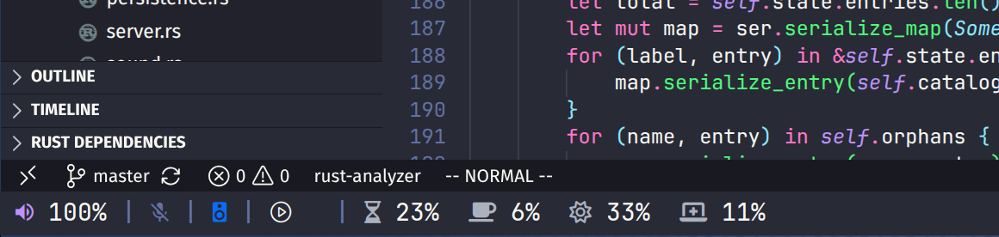

# Polybar Integration

An example Polybar script for showing OpenErgo rest, break, daily credits, and
pain status.



## Usage

Copy `openergo.py` into your Polybar config directory and make it executable:

```sh
chmod +x ~/.config/polybar/openergo.py
```

Add the module to your Polybar config:

```ini
[module/openergo]
type = custom/script
exec = ~/.config/polybar/openergo.py
tail = true
```

The script expects the `openergo` CLI to be available on `PATH`.
